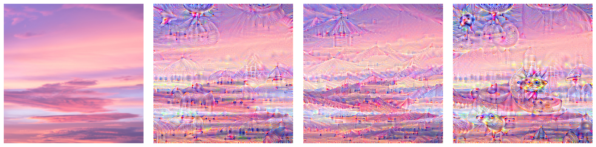
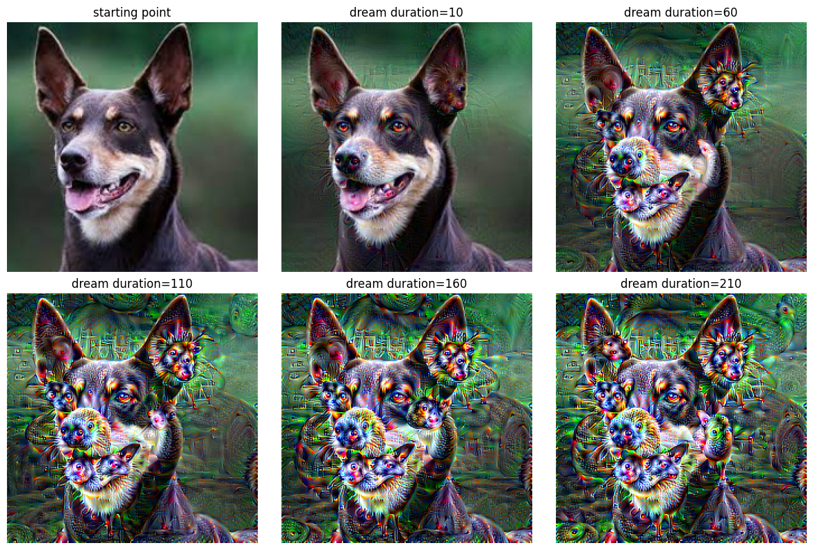
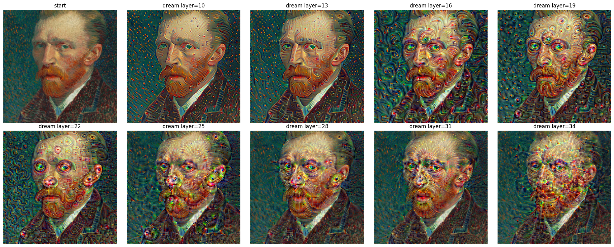
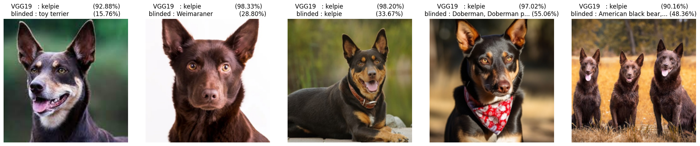
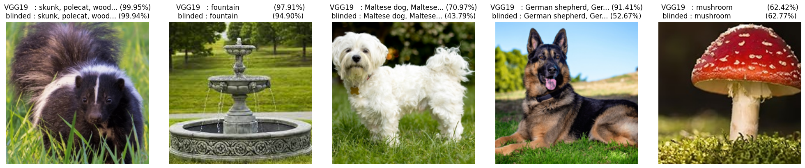

# Deepdream and Mechanistic Interpretability

## deepdream
Deepdream using `VGG19` pre-trained on `imagenet-1k`.

## mechanistic interpretability
First we try to identify features related to kelpie dogs in the `VGG19` model. And then we alter the model to make it blind to kelpies by zeroing out the identified features, while keeping the ability to classify other objects.

The third picture still register as kelpie, but everything else is gone, and the control still match, I'm ok with that :)
